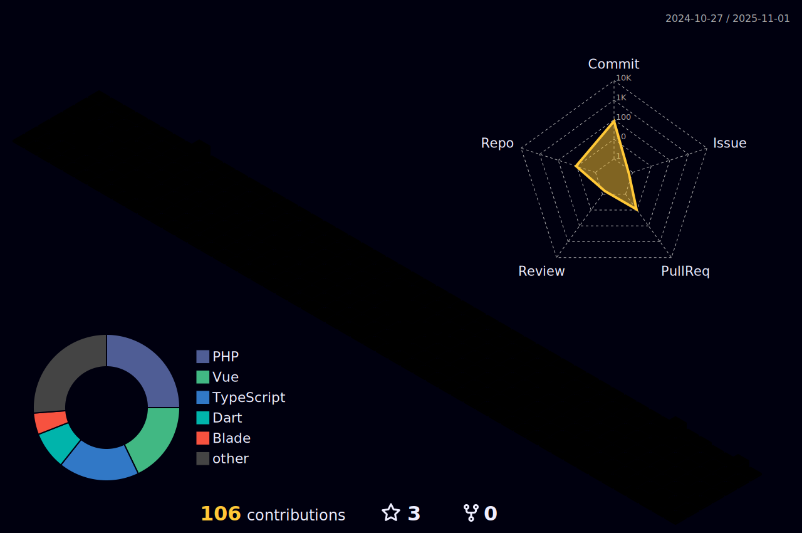

<h1 align="left">About Me</h1>

###

  

###

- Me chamo Julio Cesar  

🯠<strong>Sobre Mim</strong>  
Atualmente, atuo como Desenvolvedor Full Stack Júnior em um projeto legado, onde sou responsável por corrigir bugs, implementar melhorias e colaborar na manutenção de um sistema em produção. Utilizo tecnologias como <strong>PHP, JavaScript, TypeScript, Vue.js</strong> e <strong>MySQL</strong>, com foco em estabilidade, performance e boas práticas de desenvolvimento.  

💡 <strong>Experiência Acadêmica e Projetos</strong>  
Durante minha trajetória acadêmica e prática, participei de projetos que envolveram:  
- Desenvolvimento Full Stack utilizando <strong>C# no back-end</strong> e <strong>Vue.js no front-end</strong>; 
- Integração de sistemas baseados em <strong>APIs RESTful</strong>, com foco em segurança e escalabilidade; 
- Criação de interfaces responsivas com <strong>Tailwind CSS</strong>, priorizando uma experiência de usuário fluida.  

📈 <strong>Objetivos Profissionais</strong> 
Meu objetivo é consolidar minha carreira como desenvolvedor web e mobile, aprofundando meus conhecimentos em tecnologias modernas como <strong>React</strong> e <strong>React Native</strong>. Também busco fortalecer minhas habilidades em integração de sistemas, arquitetura de software e contribuir em projetos desafiadores que exijam inovação, qualidade e visão de produto.

###

<h1 align="left">Techs/Tools</h1>

###

  

   

  

###

<h1 align="left">Stats</h1>

###

  
  

###

<h1 align="left">Contacts</h1>

  
  
  

###

 

